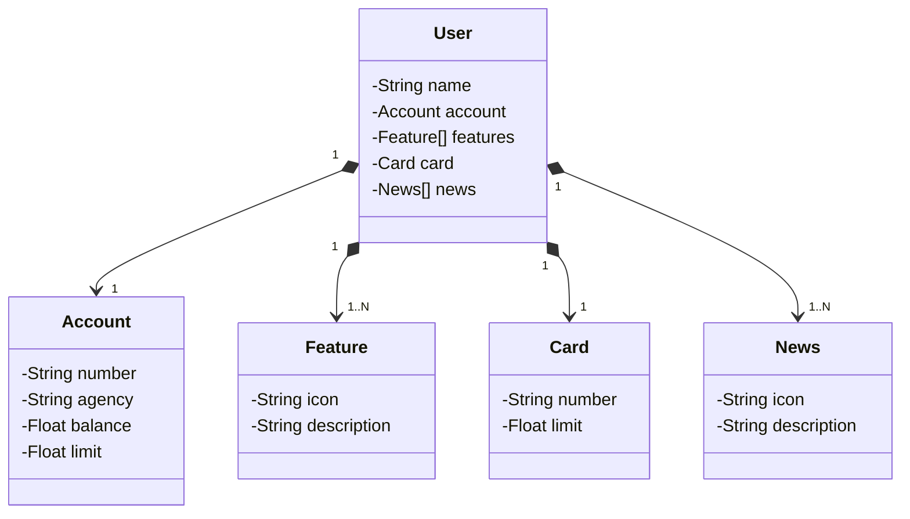

# API RESTful Decola Tech 2025
Publicando API RESTful na Nuvem Usando Spring Boot 3, Java 17 e Railway, criada para o bootcampo Decola Tech da Avanade - DIO

## Diagrama de Classes

```mermaid
classDiagram
    class User {
        -String name
        -Account account
        -Feature[] features
        -Card card
        -News[] news
    }
    class Account {
        -String number
        -String agency
        -Float balance
        -Float limit
    }
    class Feature {
        -String icon
        -String description
    }
    class Card {
        -String number
        -Float limit
    }
    class News {
        -String icon
        -String description
    }
    User "1" *--> "1" Account
    User "1" *--> "1..N" Feature
    User "1" *--> "1" Card
    User "1" *--> "1..N" News
```
